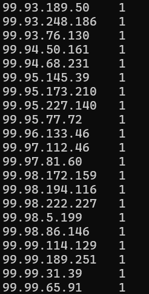

Le but de ce tuto est de vous apprendre à utiliser hadoop à l'aide de docker et maven.

## Prérequis
- Docker
- Maven
- Java 8
- Un IDE (IntelliJ IDEA, Eclipse, etc.)

## Installation de Hadoop
Pour installer le cluster hadoop, il suffit de lancer la commande suivante:
```bash 
git clone https://github.com/big-data-europe/docker-hadoop.git
cd docker-hadoop
docker-compose up
```

## Création d'un projet Maven
Vous devez creer un projet maven vide, j'utilise personnellement l'outil fournit par IntelliJ IDEA.
Ensuite, vous devez ajouter les dépendances suivantes dans votre fichier `pom.xml`:
```xml
<?xml version="1.0" encoding="UTF-8"?>
<project xmlns="http://maven.apache.org/POM/4.0.0"
         xmlns:xsi="http://www.w3.org/2001/XMLSchema-instance"
         xsi:schemaLocation="http://maven.apache.org/POM/4.0.0 http://maven.apache.org/xsd/maven-4.0.0.xsd">
    <modelVersion>4.0.0</modelVersion>

    <groupId>org.apache.hadoop.examples</groupId>
    <artifactId>tp_hadoop</artifactId>
    <version>1.0-SNAPSHOT</version>

    <properties>
        <maven.compiler.source>8</maven.compiler.source>
        <maven.compiler.target>8</maven.compiler.target>
        <project.build.sourceEncoding>UTF-8</project.build.sourceEncoding>
    </properties>

    <dependencies>
        <dependency>
            <groupId>org.apache.hadoop</groupId>
            <artifactId>hadoop-mapreduce-examples</artifactId>
            <version>3.2.1</version>
            <scope>provided</scope>
        </dependency>
        <dependency>
            <groupId>org.apache.hadoop</groupId>
            <artifactId>hadoop-mapreduce-client-common</artifactId>
            <version>3.2.1</version>
            <scope>provided</scope>
        </dependency>
        <dependency>
            <groupId>org.apache.hadoop</groupId>
            <artifactId>hadoop-common</artifactId>
            <version>3.2.1</version>
            <scope>provided</scope>
        </dependency>
    </dependencies>
    <build>
        <plugins>
            <plugin>
                <groupId>org.apache.maven.plugins</groupId>
                <artifactId>maven-shade-plugin</artifactId>
                <version>2.3</version>
                <configuration>
                    <transformers>
                        <transformer implementation="org.apache.maven.plugins.shade.resource.ApacheLicenseResourceTransformer">
                        </transformer>
                    </transformers>
                </configuration>
                <executions>
                    <execution>
                        <phase>package</phase>
                        <goals>
                            <goal>shade</goal>
                        </goals>
                    </execution>
                </executions>
            </plugin>
            <plugin>
                <groupId>org.apache.maven.plugins</groupId>
                <artifactId>maven-compiler-plugin</artifactId>
                <version>3.6.1</version>
                <configuration>
                    <source>1.8</source>
                    <target>1.8</target>
                </configuration>
            </plugin>
        </plugins>
    </build>
</project>
```

## Création d'un job MapReduce
Dans src/main/java/org/apache/hadoop/examples creer une classe Count.java:
```java
package org.apache.hadoop.examples;

import java.io.IOException;
import java.util.StringTokenizer;
import org.apache.hadoop.conf.Configuration;
import org.apache.hadoop.fs.Path;
import org.apache.hadoop.io.IntWritable;
import org.apache.hadoop.io.Text;
import org.apache.hadoop.mapreduce.Job;
import org.apache.hadoop.mapreduce.Mapper;
import org.apache.hadoop.mapreduce.Reducer;
import org.apache.hadoop.mapreduce.lib.input.FileInputFormat;
import org.apache.hadoop.mapreduce.lib.output.FileOutputFormat;
import org.apache.hadoop.util.GenericOptionsParser;

public class Count {

    public static class TokenizerMapper
            extends Mapper<Object, Text, Text, IntWritable>{

        private final static IntWritable one = new IntWritable(1);
        private Text word = new Text();

        @Override
        public void map(Object key, Text value, Context context
        ) throws IOException, InterruptedException {
            String line = value.toString();
            String lineWithPunctuationSeparated = line.replaceAll("\\.", " . ");
            lineWithPunctuationSeparated = lineWithPunctuationSeparated.replaceAll(",", " , ");
            lineWithPunctuationSeparated = lineWithPunctuationSeparated.replaceAll(";", " ; ");
            lineWithPunctuationSeparated = lineWithPunctuationSeparated.replaceAll(":", " : ");
            lineWithPunctuationSeparated = lineWithPunctuationSeparated.replaceAll("!", " ! ");
            lineWithPunctuationSeparated = lineWithPunctuationSeparated.replaceAll("\\?", " ? ");
            lineWithPunctuationSeparated = lineWithPunctuationSeparated.replaceAll("\\(", " ( ");
            lineWithPunctuationSeparated = lineWithPunctuationSeparated.replaceAll("\\)", " ) ");
            lineWithPunctuationSeparated = lineWithPunctuationSeparated.replaceAll("\\[", " [ ");
            lineWithPunctuationSeparated = lineWithPunctuationSeparated.replaceAll("]", " ] ");
            lineWithPunctuationSeparated = lineWithPunctuationSeparated.replaceAll("\\{", " { ");
            lineWithPunctuationSeparated = lineWithPunctuationSeparated.replaceAll("}", " } ");
            lineWithPunctuationSeparated = lineWithPunctuationSeparated.replaceAll("\\*", " * ");
            lineWithPunctuationSeparated = lineWithPunctuationSeparated.replaceAll("\\+", " + ");
            lineWithPunctuationSeparated = lineWithPunctuationSeparated.replaceAll("-", " - ");
            lineWithPunctuationSeparated = lineWithPunctuationSeparated.replaceAll("/", " / ");
            StringTokenizer itr = new StringTokenizer(lineWithPunctuationSeparated);
            while (itr.hasMoreTokens()) {
                String token = itr.nextToken();
                if ((token.matches("[A-Za-z0-9']+") && token.matches("[a-zA-ZÀ-ÿ]+")) || token.equals(".") || token.equals(",") || token.equals(";") || token.equals(":") || token.equals("!") || token.equals("?") || token.equals("(") || token.equals(")") || token.equals("[") || token.equals("]") || token.equals("{") || token.equals("}") || token.equals("*") || token.equals("+") || token.equals("-") || token.equals("/")) {
                    word.set(token);
                    context.write(word, one);
                }
            }
        }
    }

    public static class IntSumReducer
            extends Reducer<Text,IntWritable,Text,IntWritable> {
        private IntWritable result = new IntWritable();

        public void reduce(Text key, Iterable<IntWritable> values,
                           Context context
        ) throws IOException, InterruptedException {
            int sum = 0;
            for (IntWritable val : values) {
                sum += val.get();
            }
            result.set(sum);
            context.write(key, result);
        }
    }

    public static void main(String[] args) throws Exception {
        Configuration conf = new Configuration();
        String[] otherArgs = new GenericOptionsParser(conf, args).getRemainingArgs();
        if (otherArgs.length != 2) {
            System.err.println("Usage: wordcount <in> <out>");
            System.exit(2);
        }
        Job job = new Job(conf, "word count");
        job.setJarByClass(Count.class);
        job.setMapperClass(TokenizerMapper.class);
        job.setCombinerClass(IntSumReducer.class);
        job.setReducerClass(IntSumReducer.class);
        job.setOutputKeyClass(Text.class);
        job.setOutputValueClass(IntWritable.class);
        FileInputFormat.addInputPath(job, new Path(otherArgs[0]));
        FileOutputFormat.setOutputPath(job, new Path(otherArgs[1]));
        System.exit(job.waitForCompletion(true) ? 0 : 1);
    }
}

```
J'ai nommé la classe Count.java car il semblait y avoir un conflit avec la classe WordCount.java de hadoop.

Maintenant lancer le docker hadoop et creer le dossier data dans le container namenode:
```bash
docker exec -it namenode bash
mkdir data
```

## Compilation et exécution du job
Pour compiler le projet, il suffit de lancer la commande suivante:
```bash
mvn clean package
```

Il faut ensuite copier le jar généré dans le container hadoop, ouvrir un terminal dans le dossier target du projet et lancer la commande suivante:
```bash
docker cp <fichier jar> namenode:/data
```

Nous allons aussi copier un fichier texte dans le container hadoop:
```bash
docker cp <fichie_texte> namenode:/data
```


Vérifier que le fichier s'y trouve avec la commande:
```bash
ls /data
```
Copier le fichier texte dans le hdfs:
```bash
hdfs dfs -mkdir /data
hdfs dfs -copyFromLocal /data/<fichier_texte> /data
```
Exécuter le job:
```bash
hadoop jar /data/<fichier_jar> org.apache.hadoop.examples.Count /data/<fichier_texte> /data/output
```

Pour voir le résultat:
```bash
hdfs dfs -cat /data/output/*
```
Pour obtenir le résultat dans un fichier:
```bash
mkdir output
cd /output
hdfs dfs -copyToLocal /data/output/*
exit
docker cp namenode:/data/output.txt .
```

On éteind le cluster hadoop:
```bash
docker-compose down
```

## Passage à l'échelle
On va maintenant analyser un fichier de log de 270 mo pour calculer la fréquence de connection par adresse IP.
La classe LoginFreq se charge de ce travail et voici le résultat obtenu:




## Conclusion
Vous avez maintenant un cluster hadoop fonctionnel et vous avez pu exécuter un job MapReduce. Vous pouvez maintenant explorer hadoop et ses fonctionnalités.
